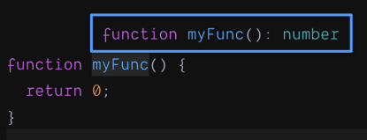
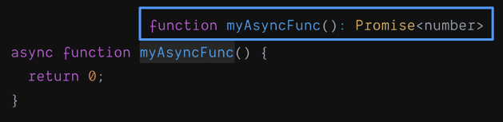
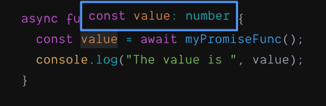



`async...await` syntax only appeared in JavaScript recently - it was introduced in ECMAScript 2017. However, it still remains a bit of mystery. Most articles I read state that ***async...await is syntactic sugar over JavaScript promises. B***ut what does that mean exactly?

Are `async` and `await` two parts of the same syntax, or they are two separate things?

Do we have to use them together with each other? Or can we use `async` without `await` and vice versa?

How different they are from [promises](https://developer.mozilla.org/en-US/docs/Web/JavaScript/Reference/Global_Objects/Promise)?

Why would we use them over promises?

Let's find out.

<!--more-->

## Typescript to the rescue

While writing this article, I wanted to know the difference between the return types of plain functions and `async` functions. However, since JavaScript is a *dynamically-typed language*, the type information is not available to us at the time we write the code. *Some* type information is available at runtime, yet it's tricky to access. However, we have a secret weapon - [Typescript](https://www.typescriptlang.org/)! It is a *strongly-typed language* build on top of JavaScript. Unlike JavaScript, the type information in TypeScript is available upfront. In modern IDEs and code editors, it is captured by a Typescript *language server* and made available to us at the time we write our code. [Visual Studio Code](https://code.visualstudio.com/) does that. As do [Codesandbox](https://codesandbox.io) and [StackBlitz](https://stackblitz.com/) when you start a [Typescript](https://stackblitz.com/) project in them.

## What does `async` really mean?

Let's start with a simple function:

```jsx
function myFunc() {
  return 0;
}
```

According to Typescript, that function returns a `number`. Which is not a surprise. It returns 0, and 0 is a `number`.



However, when we put `async` in front of the function name, its return type changes to `Promise(number)`.



That is interesting. That is a little dirty secret of `async` keyword - it turns the return type of any function into a [Promise](https://developer.mozilla.org/en-US/docs/Web/JavaScript/Reference/Global_Objects/Promise).

In our case, it is a promise that *resolves* to a `number`.

Therefore these two functions below are effectively the same:

```jsx
async function myAsyncFunc() {
  return 0;
}

function myPromiseFunc() {
  return Promise.resolve(0);
}
```

That is what `async` keyword does. That's **all** it does.

> 💡 `async` **wraps the return value into a promise.**

Now let's talk about `await`.

## What does `await` really mean?

If we have a function returning a Promise like this

```jsx
function myPromiseFunc() {
  return Promise.resolve(0);
}
```

Then the way we handle its return value is

```jsx
function printValue() {
  myPromiseFunc()
    .then(value => console.log("The value is ", value))
}
```

`myPromiseFunc` returns a Promise. Once that promise resolves, it calls a function passed as an argument to `then`.  That function receives the ***resolved value*** as an argument***.*** In our case, it is an [arrow function](https://developer.mozilla.org/en-US/docs/Web/JavaScript/Reference/Functions/Arrow_functions) which prints the value. Because `myPromiseFunc` resolves with 0, `printValue` will print "The value is  0".

However, we can rewrite `printValue` function like this:

```jsx
async function printValue2() {
  const value = await myPromiseFunc();
  console.log("The value is ", value);
}
```

`myPromiseFunc` returns a Promise. However, if we put `await` in front of calling it, then that promise automatically ***resolves*** before assigning the result to the `value`.

Here with help from Typescript we can see that the type of `value` is `number`.



Therefore this code

```jsx
const val = await myPromiseFunc()
/* Do something with val */
```

is an equivalent of

```jsx
myPromiseFunc().then(val => {
  /* Do something with val */
})
```

`val` receives the value the promise ***resolves with***.

## Error handling

Let's say we have a function returning a Promise. We usually program such functions to make their promises ***reject*** upon an error. Those rejections are handled by a function passed to a `.catch` clause following `.then`:

```jsx {hl_lines=[4]}
function printValue() {
  myPromiseFunc()
    .then(value => console.log("The value is ", value))
    .catch(err => console.log("An error was caught: ", err));
}
```

If the promise is [***rejected***](https://developer.mozilla.org/en-US/docs/Web/JavaScript/Reference/Global_Objects/Promise/reject) for some reason (that usually means that an error happened), then the function following the `catch` clause is called instead of `then`. That function receives an error object.

That is a very distinct syntax unique for promises.

On the other hand, if we use `async` ... `await` then we can write error handling code in the same way as we do in plain JavaScript and many other programming languages - with [`try`...`catch`](https://developer.mozilla.org/en-US/docs/Web/JavaScript/Reference/Statements/try...catch) blocks:

```jsx {hl_lines=["5-7"]}
async function printValue2() {
  try {
    const value = await myPromiseFunc();
    console.log("The value is ", value);
  } catch (err) {
    console.log("An error was caught: ", err);
  }
}
```

If we wrap calling an `async` function into a `try` block, and the promise returned from that `async` function is ***rejected*** (which most likely means an error), then the execution jumps to the `catch` block. That blocks receives an error object.

>💡 `await` allows us to use JavaScript `try`...`catch` error handling with asynchronous code.

## Putting it all together

You may be thinking, "***That's all wonderful. But why would I use async/await instead of plain old promises? How is that any better?***"

It makes sense if we need to chain multiple *asynchronous operations* together.

> 💡(To learn more about asynchronous operations, click [here](https://ozmoroz.com/2019/10/introduction-to-asynchronous-javascript/)).

Let's imagine that `asyncOp1` and `asyncOp3` are asynchronous functions. They all execute legitimate *asynchronous operations* and return promises. We also have `op2` which is a normal *synchronous* function. We need to string them together in the following way:

- First, we run `asyncOp1`.
- Then, once it is completed, we want to run `op2`.
- And only when it is completed too we need to run `asyncOp3`.

Each of the subsequent operation takes the result of the previous one as a parameter.

If you think that we can do simply this:

```jsx
const a = asyncOp1();
const b = op2(a);
const c = asyncOp3(b);
/* Do something with c */
```

then you're are wrong.

Remember, an asynchronous function such as `asyncOp1` and `asyncOp3` returns a promise. However, the asynchronous operation it executes is not completed **until that promise resolves**. Therefore, we have to do this:

```jsx
let c;
asyncOp1().then(a => {
  const b = op2(a);
  asyncOp3(b).then(result => (c = result));
});
/* Do something with c */
```

I may have made a typo or two there. I'm sure you can see why. That syntax is far from obvious.

However, we can write the same code as

```jsx
const a = await asyncOp1();
const b = asyncOp2(a);
const c = await asyncOp3(b);
```

Looks much nicer, isn't it? In fact, it looks remarkably similar to the synchronous code, as if all three functions were synchronous.

> 💡`await` simplifies asynchronous code, making it look like synchronous.

I hope by now you can see the clear advantages or `async` ... `await` over promises.

However, there is a catch.

## The catch

If you looked closely enough, you noticed that the declaration of `printValue2` is prepended with `async`, while `printValue` wasn't:

```jsx
function printValue() {
...
}

async function printValue2() {
...
}
```

Yet, those two functions do the same. Why do we need `async` in one case but not the other?

Turns out that the JavaScript execution environment forbids `await` keyword appearing anywhere except inside of `async` functions.

If we omit `async` from the declaration of `printValue2` then we get this JavaScript error:

***'await' expressions are only allowed within async functions and at the top levels of modules.***

At the time of writing, `await` is only allowed inside `async` functions or [at the top-level Node.js modules](https://github.com/tc39/proposal-top-level-await) starting with Node.js 14.2.

That is an odd restriction. No matter how much I googled I wasn't able to find a reason for that. After all, `await` is just *syntactic sugar* for promises. And promises are allowed outside of `async` functions.

## To sum up

- Putting `async` in front of the function makes that function returns a ***promise*** which ***resolves*** with the value the function returns.

```jsx
async function myAsyncFunc() {
  return 0;
}
```

returns `Promise.resolve(0)`

- Putting `await` in front of calling a function which returns a promise pauses the execution until that promise resolves, then the result evaluates to the value the promise resolves with.

```jsx
const a = await myAsyncFunc()

// a equals 0
```

- `async` ... `await` allows using the usual JavaScript [try...catch syntax](https://developer.mozilla.org/en-US/docs/Web/JavaScript/Reference/Statements/try...catch) for catching errors.

```jsx
try {
  await myAsyncFunc();
} catch (err) {
  console.log("An error was caught: ", err);
}
```

- `await` simplifies asynchronous code, making it look like synchronous.

```jsx
const a = await asyncOp1();
const b = op2(a);
const c = await asyncOp3(b);
```

- `await` can only be used inside of `async` functions or at the top level of Node.js modules with Node.js version 14.2 or higher.

As always, if you have any questions, leave then in the comments section below (you'll need to log in).

Happy coding!
