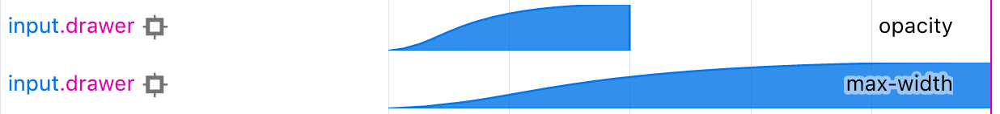
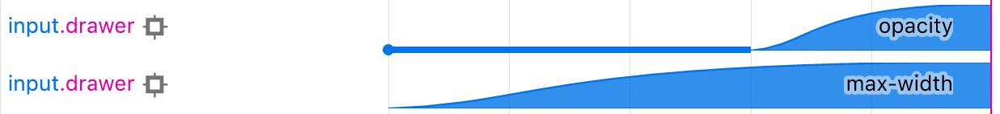
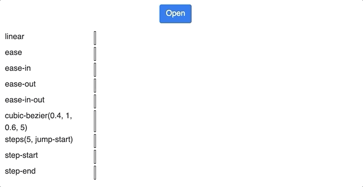



Animating things on the web is a pretty common task. You often need to animate a menu bar sliding from the top, or an input field expanding and collapsing when you click a button. But how do you do that?

Maybe there is a library for that? Yes, lots. But which one you should choose?  When you are pressed with a deadline, you don't have time to plough through lots of libraries and their documentation, you just want to know the simplest way to do what you need as simple and as quick as possible.

Fear no more. I will show you everything you need to know to cover most of your React animation requirements. In this article, we will cover CSS Transitions which is the easiest way to animate elements on the web page. Moreover, you will see why CSS transitions are one of the simplest yet coolest techniques on the web.

<!--more-->

Here we go.

CSS Transitions actually has nothing to do with React.  Quoting [MDN](https://developer.mozilla.org/en-US/docs/Web/CSS/CSS_Transitions),

>  **CSS Transitions** is a module of CSS that lets you create
> gradual transitions between the values of specific CSS properties. The 
> behaviour of these transitions can be controlled by specifying their 
> timing function, duration, and other attributes.

Because CSS transitions is a pure CSS, they can be used in React applications, Angular, plain Javascript or even old-school plain HTML with no Javascript at all.

It is not the most versatile or powerful technique. But since in most cases, the animations we want are pretty simple, why looking for something more complicated when a simple will do the job?

CSS Transitions are also [well-supported by all major browsers](https://caniuse.com/#feat=css-transitions) with a notable exception of Opera Mini and IE below version 10.

CSS Transitions give us an ability to **animate between two CSS states**. Let's say you want to animate the opening and closing of a drawer, triggered by a click on a button. Let's assume we have a [flex] (https://css-tricks.com/snippets/css/a-guide-to-flexbox/) container around the drawer. When the drawer is opened, we want it to occupy 100% of the container width, therefore its `max-width` should be 100%. When it is closed, its width should be 0. We can create two CSS styles:

```js
/* This CSS style is applied when the drawer is opened */
const openedStyle = {
  maxWidth: '100%' /* max-with is 100% when the drawer is opened */,
};

/* This CSS style is applied when the drawer is closed */
const closedStyle = {
  maxWidth: 0 /* max-width is 0 in the closed drawer */,
};
```

Then we add an `onClick` event handler to the "Open / Close" button. That handler applies one of the above CSS classes to the drawer element on opening/closing:

```js
class Drawer extends React.Component {
  state = {
    opened: false // Initially search form is Closed
  };

  toggleOpened = () =>
    // Toggle opened / closed state.
    // Because we rely on the previous state, we need to use
    // a functional setState form
    // https://ozmoroz.com/2018/11/why-my-setstate-doesnt-work/
    this.setState(state => ({ ...state, opened: !state.opened }));

  render() {
    const { opened } = this.state;
    return (
      <div className="drawer-container col-12 col-md-4">
        <input
          type="text"
          className="drawer"
          // Apply 'openedStyle' CSS class if the drawer is opened,
          // and 'closedStyle' if the drawer is closed.
          style={opened ? openedStyle : closedStyle}
        />
        <button
          type="button"
          className="open-close-button btn btn-primary"
          onClick={this.toggleOpened}
        >
          {opened ? 'Close' : 'Open'}
        </button>
      </div>
    );
  }
}

export default Drawer;
```

When we press the "Open / Close" button, the drawer will flip between 0 and 100% width, effectively opening and closing.


Now we need now is to animate it.

For that, we need a secret ingredient - a CSS `transition` property. All we need to do is to add it to the drawer's style:

```javascript
/* This CSS style is applied when the drawer is opened */
const openedStyle = {
  maxWidth: '100%' /* max-with is 100% when the drawer is opened */,
  /* Upon transitioning to Open,
     animate `max-width' for 0.5s*/
  transition: 'max-width 0.5s'
};

/* This CSS style is applied when the drawer is closed */
const closedStyle = {
  maxWidth: 0 /* max-width is 0 in the closed drawer */,
  /* Upon transitioning to Closed,
     animate `max-width' for 0.5s */
  transition: 'max-width 0.5s'
};
```

Voilà! We've got our animation - upon clicking the button our drawer is now expanded and collapsed within half a second!


But wait, there's more to it.

With a single `transition` property we can animate more than one CSS attribute. Let's say we want our drawer to gently fade into view apart from expanding. We can make that by adding `opacity` attribute to the opened and closed CSS styles.

```js
/* This CSS style is applied when the drawer is opening and opened */
const openedStyle = {
  maxWidth: '100%' /* max-with is 100% when the drawer is opened */,
  opacity: 1 /* opened drawer is opaque */,
};

/* This CSS style is applied when the drawer is closing and closed */
const closedStyle = {
  maxWidth: 0 /* max-width is 0 in the closed drawer */,
  opacity: 0 /* closed drawer is transparent */,
};
```

Then add `opacity` to the `transition` CSS property. That tells the browser that we want to animate **both** `max-width` and `opacity`.

```javascript
/* This CSS style is applied when the drawer is opened */
const openedStyle = {
  maxWidth: '100%' /* max-with is 100% when the drawer is opened */,
  opacity: 1 /* opened drawer is opaque */,
  /* Upon transitioning to Open,
     animate `max-width' for 0.5s and opacity for 0.2s */
  transition: 'max-width 0.5s, opacity 0.2s'
};

/* This CSS style is applied when the drawer is closed */
const closedStyle = {
  maxWidth: 0 /* max-width is 0 in the closed drawer */,
  opacity: 0 /* closed drawer is transparent */,
  /* Upon transitioning to Closed,
     animate `max-width' for 0.5s and opacity for 0.2s */
  transition: 'max-width 0.5s, opacity 0.2s'
};
```

The idea is to have the drawer fade in first for 0.2 seconds then finish the transition expanding for the remaining 0.3s.


However, that is not exactly what we wanted. If you look closely, you may notice that our transition behaves as expected on expansion: the drawer fades into view first and then finish expanding.

However, the reverse transition is not quite right: instead of shrinking first and then fading out it simply fades out.

To understand what's going on, let's have a look at the browser animation view. 

To access that view in Chrome bring up Developer Tools → Elements pane. Then click on the dotted menu icon, choose More Tools → Animations.

In Firefox it is under Developer Tools → Elements pane → Animations tab.

Here is a timeline of the opening animation:



As we can see, opacity is being animated for the first 0.2 seconds and max-width for 0.5s. Both transitions **start at the same time**.

Turns out, exactly the same happens when we close the drawer. Because the transitions start at the same time but the opacity animation is shorter, the drawer fades out of view before we have a chance to see its shrinking.

To fix that, we need to add a **delay** to the `max-width` transition upon closing the drawer.

```javascript
/* This CSS style is applied when the drawer is closing and closed */
const closedStyle = {
  maxWidth: 0 /* max-width is 0 in the closed drawer */,
  opacity: 0 /* closed drawer is transparent */,
  /* Upon transitioning to Closed,
     animate `max-width' for 0.5s
     and 'opacity' for 0.2s  with 0.3s delay */
  transition: 'max-width 0.5s, opacity 0.2s 0.3s'
};
```

That tells the browser to delay the opacity animation for 0.3s. That way `max-width` transition starts first but both `opacity` and `max-width` transition finish at the same time, creating the effect we need.


These are timelines of opening and closing animations:




## Timing function

Another parameter you may want to play with is a [*timing function*](https://developer.mozilla.org/en-US/docs/Web/CSS/transition-timing-function). It defines the "shape" of the transition curve. For example, `ease` will start swiftly and will slow down at the end. On the other hand, `linear` will proceed with a constant speed throughout the entire range.

The default value is `ease`. There are a few others, all of them are documented on [<timing-function> MDN page](https://developer.mozilla.org/en-US/docs/Web/CSS/timing-function).

Here is what the same transition looks like with different timing functions:



> If you enter your email into the **Subscribe** box at the bottom of the page, I will send you a link to an interactive demo page where you can play with above transition types, change their parameters and immediately see the effect.
>
> **Additionally**, you will get notified straight into your email inbox as soon as I publish a new article.

## When CSS transitions don't work

However, CSS transitions don't always work, there are a few notable exceptions.

**First of all, CSS transitions don't work if a CSS property being animated is binary.**

Obviously, you can't animate a property that can **only** take *true* or *false*. Most of the properties that can be animated take numeric values (although there are a few exceptions). The list of properties which can be transitioned can be found on [Animatable CSS properties MDN page](Animatable CSS properties).

**CSS transitions don't work if an element being animated is dynamically removed from & inserted into DOM.**

Which means that you can't use CSS Transitions on [conditionally rendered](https://reactjs.org/docs/conditional-rendering.html) React components. Also, you can't use CSS transitions to animate *mounting* and *unmounting* of React elements.

But what if you need to? I will cover that in my next article. Subscribe at the bottom of the page and stay tuned.

**CSS transitions don't work if one of the properties of an initial or a final state is `display`**

You can't animate between `display: none` and `display`*-something-else* because [CSS `display` property](https://developer.mozilla.org/en-US/docs/Web/CSS/display) is not *transitionable*. The list of properties which can be transitioned can be found on [Animatable CSS properties MDN page](Animatable CSS properties).

However, even if you don't want to animate CSS `display` property but just have it change between initial and final states, your animation won't run.

Let's face it, there is little reason to show & hide an element as a part of a transition. A much better way is to achieve the same result with a transitionable property such as `width` or `opacity`. If you set `width` and `opacity` to 0, you effectively hide the element. However, If you absolutely must hide & show the element as a part of a transition, use [CSS `visibility` property](https://developer.mozilla.org/en-US/docs/Web/CSS/visibility) instead of `display`.

There you have it, now you know enough about CSS transitions to be dangerous. That will cover most of your typical requirements, and even allow you to do some cool stuff. These [animated hearts](https://css-heart-animations.netlify.com/), for example, were made purely with plain HTML and CSS transitions.

Stay tuned to my next article which will be about animating React elements dynamically inserted into & removed from DOM. Subscribe at the box below, and I'll email you the link as soon as it's out.
